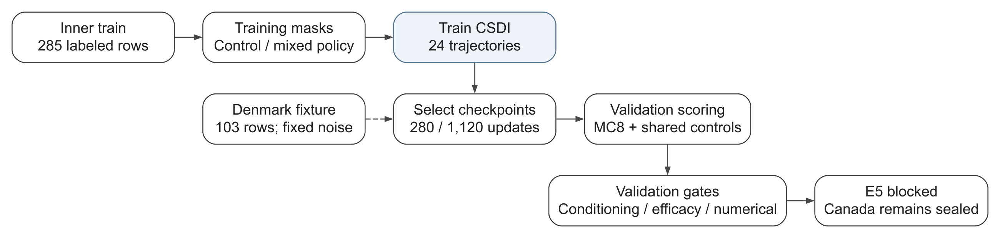
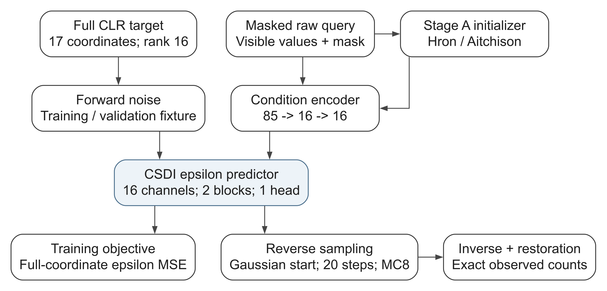

# Pipeline Architecture Report — E3/E4 Mask-Conditioning Diagnostic
**Date:** 2026-10-06  
**Experiment ID:** `e3e4_mask_conditioning_2026-10-06`  
**Status:** Completed — Negative result (gates FAIL, E5 BLOCKED)

---

## 1. Pipeline Overview

The figures summarize the completed **CLR-only mask-policy × optimization-budget diagnostic**. They use a compact paper-style layout: short labels, white background, thin lines and one muted model highlight. Details and parameter values are provided in the captions and text. The dashed arrow in Figure 1 denotes the validation signal used for checkpoint selection.

**Preview after cloning:** open this file in Markdown Preview. Both PNG images are included in the repository and use relative `./figures/` paths; no Mermaid extension or figure-generation dependencies are needed to view them.

### 1.1 Experiment flow



*Figure 1. Experimental protocol. Control uses 18 random-cell mask banks; the mixed policy uses 9 paired random-cell and 9 whole-variant banks. Both policies use four conditioning modes, three seeds and nested 280/1,120-update checkpoint selection from each trajectory. Denmark supplies the fixed checkpoint fixture and final validation scores; shared Init-only/Linear/LOCF controls enter scoring directly. Both budgets fail conditioning and efficacy, while numerical checks pass. Canada remains sealed.*

[Open vector figure](./figures/pipeline_experiment_overview.svg) · [Editable Mermaid source](./figures/pipeline_experiment_overview.mmd) · [Graphviz source](./figures/pipeline_experiment_overview.dot)

### 1.2 Model, training objective and inference



*Figure 2. Compositional CSDI adaptation. Full normalized CLR targets and masked raw conditions enter separate branches. Stage A is optional: raw-only/mask-only modes bypass initialization. The initializer supplies side information; reverse sampling starts from Gaussian noise. The training loss covers all 17 CLR coordinates. Inference denormalizes and projects each completed chain, averages eight latents, applies CLR inverse and restores observed raw counts exactly. See §§1.3–1.4 for dimensions and scale handling.*

[Open vector figure](./figures/pipeline_model_detail.svg) · [Editable Mermaid source](./figures/pipeline_model_detail.mmd) · [Graphviz source](./figures/pipeline_model_detail.dot)

### 1.3 Data and information boundaries

| Boundary | Actual implementation |
|---|---|
| Outer fold | Canada held out; outer train contains all other locations, including Denmark |
| Inner donor pool | **11,453 rows**, excluding Denmark and Canada; partial rows may supply eligible Stage A donors |
| Diffusion ground truth | **285 complete, positive-sum rows** from Netherlands/UK/US; **38** nonoverlapping location/time windows, length ≤8, no padding |
| Eligibility correction | Config `n_train_rows=298` counts complete rows before the positive-sum filter; the runtime excludes 13 complete zero-sum rows and uses 285 |
| Validation | **103** complete, positive-sum Denmark rows in **13** windows; rows with no positive visible anchor remain eligible |
| Hidden labels | Used for full-CLR target/loss and final scoring; hidden raw values are absent from condition inputs and initializer queries |
| Observed zeros | Retained as observations and restored exactly; zero replacement with delta=0.5 belongs to log-ratio transformation |
| Test boundary | Canada remains sealed throughout `prepare`, `train`, and `evaluate`; the runner enforces `--no-test` |

**Tensor dimensions:** `B` = batch windows, `L` = window length, `K=17` = CLR coordinates, `C=16` = model channels. “CLR16” is the experiment label for rank-16 CLR geometry; it does not mean a 16-coordinate tensor. Config fields recording latent dimension 16 are metadata discrepancies; actual model/evaluation tensors use 17.

### 1.4 Conditioning modes and output contract

Each row has **85 condition slots**: 17 visible `log1p` values divided by raw scale, 17 visibility indicators, 17 initializer `log1p` values divided by raw scale, 17 fallback flags and 17 effective-k/4 values. The encoder maps **85 → 16 → 16**, then broadcasts the row condition across all 17 latent positions and adds time/feature embeddings.

| Mode | Visible values | Visibility | Initializer + provenance |
|---|---|---|---|
| `mask_only` | Zero | Included | Zero |
| `no_init` | Included | Included | Zero |
| `hron_2a` | Included | Included | Hron-2A plus fallback/effective-k |
| `aitchison_complete` | Included | Included | Aitchison-complete plus fallback/effective-k |

**Training:** fit latent mean/scalar scale on eligible inner-train targets, rotate the frozen mask bank by `epoch % 18`, sample a diffusion step and Gaussian noise, and optimize epsilon MSE on **all 17 latent coordinates**. A raw visibility mask is not copied to the CLR loss. The model has **19,713 parameters**, two residual blocks, temporal and feature attention with one head, FFN width 64, and float64 numerics.

**Inference:** run eight independent Gaussian reverse chains, 20 steps each; denormalize each chain and apply final sum-zero projection; average projected latents; apply CLR inverse/softmax; estimate row scale by the median positive-visible count/composition ratio; overwrite every observed raw count, including zeros. When no positive visible anchor exists, the adapter uses scale 1 and records the row as unanchored. Clipping and per-step projection are disabled. Init-only controls bypass diffusion and its inverse adapter.

**Primary scenarios:** `whole_rare_n2` hides `20C/Kappa`, `whole_middle_n2` hides `Delta/Omicron`, and `whole_common_n2` hides `recombinant/Omicron`. These train-derived scenario sets can overlap. Their ordering uses positive-observation prevalence, rather than raw abundance magnitude. `random_cell_bank0` is secondary.

The PNG figures are the default report content, so reading this section does not depend on a Mermaid renderer. The companion `.mmd` files retain compact flowcharts with quoted labels, including labels containing parentheses or symbols.

---

## 2. Pipeline Components

| Stage | Module | Purpose | Key Parameters |
|-------|--------|---------|----------------|
| **E0** | `artifacts/e0_extended/` | Outer CV split (fold 0), frozen evaluation masks | Test=Canada; Val=Denmark; full-label train=NL/UK/US; donor pool=all other locations |
| **E1** | `src/stage_a/initializers_e1.py` | Hron 2A, Aitchison Complete initializers; fallback values | Cross-fit donors, location exclusion |
| **E2** | `artifacts/e2_transforms/transforms.py` | CLR on 17 variants (17 coords, rank 16), positivity delta=0.5, exact observed restoration | Final sum-zero projection before inverse; visible-anchor scale + exact `restore_observed_counts` |
| **Stage B Core** | `src/stage_b/research_csdi_rework.py` | `CSDICoreRework`: 1-head attention, configurable channels | K=17, C=16, 19,713 params; layers=2, steps=20, heads=1, FFN=64 |
| **Stage B Ops** | `src/stage_b/research_csdi.py` | `condition_features`, `forward_noise`, `epsilon_loss`, `sample_latents`, `schedule`, `project_final` | DDPM quad β, MC=8, final-only projection |
| **Gates** | `src/evaluation/rework_gates.py` | Conditioning, Efficacy, Numerical/Restoration gates | Thresholds: cond ∀, eff >10%, num exact |
| **Runner** | `scripts/run_e5_mask_conditioning.py` | CLI: prepare / train / evaluate; cache resume; frozen masks/hashes | 24 traj, 2 budgets, 48 entries |

---

## 3. Experimental Design (Factorial §11.2)

| Factor | Control | Intervention |
|---|---|---|
| **Training Mask Policy** | 18 random-cell banks, 5 hidden/row | 9 paired random-cell banks, identical to control 0–8, plus 9 whole-variant banks |
| **Whole-Variant Strata** | — | n_hidden={1,2,3} × prevalence={rare,middle,common}; train-only ordering |
| **Optimization Budgets** | **Both:** 280 and 1,120 updates | **Both:** 280 and 1,120 updates |
| **Modes** | no_init, mask_only, hron_2a, aitchison_complete | Same four modes |
| **Seeds** | 42, 43, 44 | Same three seeds |
| **Training Trajectories** | 12 | 12 |
| **Checkpoint Entries** | 24, two selections per trajectory | 24, two selections per trajectory |

**Checkpoint rule:** each epoch scores the current model on the frozen Denmark fixture: all 103 eligible rows / 13 windows, 20 diffusion steps, three primary whole-variant n2 masks, replayed noise seed 919. The code averages steps within each window, windows within each mask, then the three masks equally. The earliest argmin is selected within epochs 1–40 for Budget280 and 1–160 for Budget1120. Both checkpoints come from the same trajectory and are correlated observations.

**Weighting note:** the plan describes a “cell-weighted” fixture, while the implementation gives equal weight to windows of potentially different lengths. This report documents the implemented reduction. Train traces separately log batch-mean and cell-weighted losses; equal-length window batching produces seven optimizer updates per epoch. The 1,120-update budget is a diagnostic budget, not an established optimum.

**Counting:** 24 trajectories × two budgets = **48 checkpoint entries**. Each is scored on four scenarios: **192 model–scenario records**. Four shared controls × four scenarios add **16 records**, giving **208 unique evaluation records**. Numerical gates inspect 64 records per policy/budget: 48 model–scenario records plus the 16 shared controls; those shared controls recur in gate checks.

---

## 4. Model Evaluation Summary

### 4.1 Gate Results (Both Budgets)

| Gate | Budget280 | Budget1120 | Verdict |
|------|-----------|------------|---------|
| **Conditioning** (mask_only > no_init ∀ seeds/scenarios/policies) | FAIL (control: 0/3 scenarios pass) | FAIL (control: 1/3 scenarios pass) | ❌ FAIL |
| **Efficacy** (init+CSDI >10% M2 gain over init-only ∀ seeds/scenarios) | FAIL (0/2 init pairs qualify) | FAIL (0/2 init pairs qualify) | ❌ FAIL |
| **Numerical/Restoration** (finite, non-neg, observed-locked) | PASS (64/64 per policy) | PASS (64/64 per policy) | ✅ PASS |

### 4.2 Per-Policy Conditioning Detail

| Policy | Budget | whole_rare_n2 | whole_middle_n2 | whole_common_n2 | Overall |
|--------|--------|---------------|-----------------|-----------------|---------|
| **Control** | 280 | FAIL (1/3 seeds) | FAIL (2/3 seeds) | FAIL (2/3 seeds) | FAIL |
| **Control** | 1120 | FAIL (2/3 seeds) | FAIL (2/3 seeds) | PASS (3/3 seeds) | FAIL |
| **Intervention** | 280 | FAIL (1/3 seeds) | PASS (3/3 seeds) | FAIL (2/3 seeds) | FAIL |
| **Intervention** | 1120 | FAIL (1/3 seeds) | PASS (3/3 seeds) | PASS (3/3 seeds) | FAIL* |

*Intervention Budget1120 passes middle/common but independently fails rare (only 1/3 seeds). Control also fails. Overall conditioning requires every primary scenario and seed to pass for every policy.

### 4.3 Efficacy Detail (Budget1120, Intervention Policy)

Values below summarize **all three model seeds**; Init-only is the shared deterministic control. Relative gain = `100 × (1 − mean diffusion M2 / Init-only M2)`. Negative gain means higher error.

| Initializer | Scenario | M2 Init-only | Mean M2 Init+CSDI | Relative gain | Nonzero MAE not worse | Seeds PASS |
|---|---|---:|---:|---:|---:|---:|
| hron_2a | whole_rare_n2 | 1.194 | 16.546 | -1286.0% | 1/3 | 0/3 |
| hron_2a | whole_middle_n2 | 12.081 | 42.907 | -255.2% | 0/3 | 0/3 |
| hron_2a | whole_common_n2 | 39.422 | 85.924 | -118.0% | 0/3 | 0/3 |
| aitchison_complete | whole_rare_n2 | 1.170 | 16.705 | -1327.6% | 1/3 | 0/3 |
| aitchison_complete | whole_middle_n2 | 12.081 | 43.173 | -257.4% | 0/3 | 0/3 |
| aitchison_complete | whole_common_n2 | 39.422 | 86.553 | -119.6% | 0/3 | 0/3 |

**Metric interpretation:** M2 is mean squared Aitchison distance on the complete restored 17-part prediction/truth rows, using the registered zero treatment; lower is better. It is not raw-count MSE or a hidden-cell-only MSE. Nonzero CLR MAE is measured on hidden cells with positive truth. Efficacy requires strictly >10% M2 improvement **and** no worse nonzero CLR MAE for every primary scenario and seed of at least one policy/initializer pair.

**Observed result:** across both budgets and policies, every evaluated initializer/primary-scenario/seed cell has worse M2 than its matching Init-only control, with error ratios **2.08–34.36×**. This demonstrates failure of the evaluated configurations, without establishing a specific causal mechanism.

### 4.4 Selected Checkpoint Epochs

This table is regenerated from the current `best_epochs.json`; all 48 selections match the corresponding training-cache indexes. Columns list seeds 42/43/44 in that order.

| Policy | Mode | Seeds | Budget280 Epochs | Budget1120 Epochs |
|---|---|---|---|---|
| control | no_init | 42 / 43 / 44 | 40 / 32 / 37 | 160 / 156 / 158 |
| control | mask_only | 42 / 43 / 44 | 40 / 32 / 37 | 160 / 156 / 147 |
| control | hron_2a | 42 / 43 / 44 | 40 / 32 / 39 | 159 / 156 / 158 |
| control | aitchison_complete | 42 / 43 / 44 | 40 / 32 / 39 | 159 / 156 / 158 |
| intervention | no_init | 42 / 43 / 44 | 39 / 32 / 37 | 159 / 156 / 158 |
| intervention | mask_only | 42 / 43 / 44 | 40 / 32 / 37 | 152 / 156 / 160 |
| intervention | hron_2a | 42 / 43 / 44 | 40 / 33 / 39 | 160 / 151 / 158 |
| intervention | aitchison_complete | 42 / 43 / 44 | 39 / 33 / 39 | 160 / 151 / 158 |

---

## 5. Method Selection Rationale

| Decision | Rationale |
|----------|-----------|
| **Protocol U (not K)** | Frozen E0 audit does not validate `total_sequence` as the sum of the 17 parts; Protocol U uses CLR geometry and visible-anchor raw scale. Native JSD remains a secondary diagnostic |
| **CLR16 only (no ILR/HKGLR)** | Registered diagnostic scope §11.2: single transform to isolate mask/budget effects; geometry/reference controls deferred to R7. Note: CLR on 17 parts produces 17 coordinates (rank 16, sum-zero); metadata says "latent_dim=16" but actual latent_dim=17 — this is a documentation correction, not a model change |
| **Single-head attention (heads=1)** | Inherited from the rework single-head policy and held fixed in every arm; this diagnostic does not isolate head count or channel capacity |
| **DDPM 20 steps, quad schedule** | Frozen from E3/E4 revised; changing scheduler confounds mask/budget isolation |
| **MC=8, final-only projection** | Registered; clipping disabled per Protocol U; scale-guard recorded not gated |
| **Paired random-cell banks** | Control and intervention share banks 0-8 → isolates whole-variant effect from bank-count confound |
| **9 whole-variant strata** | Covers n_hidden={1,2,3} × {rare,middle,common}; train-only variant ordering prevents leakage |
| **Dual budgets from same trajectory** | Not independent replicates; tests whether longer training helps same model (avoids seed variance) |
| **Fixed validation fixture (not random)** | Reproducible checkpoint selection; noise seed 919, earliest argmin; same for all arms |
| **Canada never evaluated** | The diagnostic runner always enforces `--no-test`; a qualifying pilot first requires full transform/reference confirmation and frozen selection before a later E5 run |

---

## 6. Key Findings

1. **Conditioning gate fails for both policies and budgets.** At Budget1120, whole-common passes all three seeds under control; whole-middle/common pass under intervention. Whole-rare still fails, so neither policy qualifies.

2. **The larger budget does not rescue efficacy.** Every evaluated Init+CSDI primary cell has worse M2 than its matching Init-only baseline. The result does not isolate whether masking, representation, optimization, the condition bottleneck or scale restoration is responsible.

3. **Numerical integrity passes.** Every policy/budget gate passes finite, non-negative and exact observed-restoration checks. Scale-guard flags are recorded and do not reject rows or determine PASS.

4. **Scope remains narrow.** This diagnostic uses one outer fold, Denmark validation, three model seeds and CLR only. Seeds repeat model randomness, not independently sampled populations; paired budgets share trajectories. No held-out Canada performance is established.

5. **Unknown scale remains a scientific limitation.** Protocol U cannot infer raw mass from composition alone when all visible anchors are zero. The adapter's scale-1 fallback is explicit and flagged; it does not establish identifiable raw-count imputation.

---

## 7. Next Steps

### Immediate (No New Experiments)
- [x] Preserve the completed negative result; plan §11.4 contains the status/artifact record (some prose summaries differ from current artifacts; this report uses the artifacts)
- [x] Preserve all artifacts for audit trail
- [x] Keep Canada sealed (never evaluated)

### Conditional (R6 — Architecture Ablation)
**If** pursuing a separately registered token-conditioning architecture ablation (§11.3), the failed pilot permits a new diagnostic study; it does not open E5:
- Register separate experiment with parameter-count matching (±5%)
- Raw-feature condition tokens: 17 parts × (value, mask, init, provenance)
- Cross-part attention preserving CLR/ILR dependencies
- Same locked masks, updates, windows, optimizer, seeds
- Compare against broadcast 85→C encoder baseline
- Include raw/init value ablations, step-band losses, gradient norms
- Do NOT claim larger model improvement proves token conditioning alone

### Blocked (R7 — Confirmation & E5)
- Full transform/reference confirmation (CLR16/17, ILR16, HKGLR actual/random/high)
- Requires a **qualifying arm** from the current pilot or a separately registered follow-up (none currently exists)
- Canada evaluation only after frozen finalist selection

---

## 8. Artifact Index

| Path | Description |
|------|-------------|
| `artifacts/e3e4_mask_conditioning_2026-10-06/config.json` | Full experiment config, hashes, gate definitions |
| `artifacts/e3e4_mask_conditioning_2026-10-06/evaluation_scores.json` | 24 trajectories × 2 nested budgets × 4 scenarios = 192 model–scenario records |
| `artifacts/e3e4_mask_conditioning_2026-10-06/control_scores.json` | 16 shared Init-only / baseline scenario records |
| `artifacts/e3e4_mask_conditioning_2026-10-06/validation_gates.json` | Per-policy per-budget gate details |
| `artifacts/e3e4_mask_conditioning_2026-10-06/best_epochs.json` | Selected checkpoint epochs/losses |
| `artifacts/e3e4_mask_conditioning_2026-10-06/failure_records.json` | Per-entry contract violations (empty) |
| `artifacts/e3e4_mask_conditioning_2026-10-06/e5_mask_conditioning_status.json` | Final status: BLOCKED, finalists=[], canada_evaluated=false |
| `scripts/run_e5_mask_conditioning.py` | Reproducible runner: prepare / train / evaluate |
| `reports/figures/pipeline_*.png` and `.svg` | Embedded raster figures and scalable vector figures |
| `reports/figures/pipeline_*.dot` and `.mmd` | Editable Graphviz and quoted-label Mermaid sources |
| `scripts/render_pipeline_architecture_report.mjs` | Rebuild the two PNG/SVG figures without running research code |
| `tests/unit/stage_b/test_e5_mask_conditioning.py` | 15 unit tests for mask/gate/cache logic |

---

## 9. Conclusion

**No arm qualifies; E5 remains BLOCKED and Canada remains sealed.** The matched-mask, two-budget CLR diagnostic does not meet the registered conditioning or efficacy requirements. A longer budget improves some conditioning comparisons but does not yield the required initializer-relative benefit. Numerical/restoration PASS establishes the output contract, not scientific efficacy.

These results apply to the evaluated configurations on Denmark validation. They do not prove that diffusion models generally fail for compositional imputation or identify a single cause. A separately registered architecture ablation may follow §11.3; any qualifying pilot must still undergo full transform/reference confirmation and finalist freezing before E5.

## 10. Code Review, Academic Review and Figure Verification

The revised figures and tables were checked in separate read-only code-review and academic-review passes against the **current** mask-conditioning experiment. Historical audit/undertraining/capacity reports inform the motivation; their experiment-B sample counts and narrow fixture are not results of this diagnostic. Current JSON artifacts take precedence when prose in earlier reports or the plan differs.

| Review area | Evidence and correction |
|---|---|
| Split, labels, mask order | `run_e5_mask_conditioning.py`: inner pool excludes Denmark; full-positive runtime eligibility; masks feed conditions before optimization |
| Core and input dimensions | `research_csdi_rework.py` and cached evaluation metadata: K17/C16, 85→16→16 condition encoder, 19,713 parameters |
| Loss and checkpoint rule | `fit_with_dual_budget` / `build_fixed_validation_fixture`: full-coordinate epsilon loss; replayed fixture each epoch; equal-window reduction; nested earliest argmins |
| Sampling/restoration order | `research_csdi.py:sample_latents`, `run_e5_rework.py:evaluate_csdi_on_scenario`, E2 `restore_observed_counts`: per-chain denormalization/projection, latent mean, inverse, scale estimate, exact overwrite |
| Metrics and decision | `research_pilot.py`, `rework_gates.py`, current `validation_gates.json`: lower-is-better M2; all-seed/scenario comparisons; per-policy aggregation; scale guard diagnostic-only |
| Scientific scope | Plan §§11.2–11.3: mask/budget diagnostic; paired budgets; conditional architecture ablation; full confirmation before E5 |
| Reproducibility | Current `best_epochs.json` versus all training-cache indexes; current gates/scores/status; editable figure sources with raster and vector outputs |

**Verification for this report edit:** both Graphviz sources rendered successfully to SVG and PNG and were visually inspected for readable labels and unobstructed flow. The figures replace the Mermaid-dependent main view. Mermaid sources use quoted labels to avoid the original punctuation parse error; execution of those sources in the user's Mermaid renderer has not been independently verified. Research training, inference and gates were not rerun or changed. The plan records a prior 123-test PASS result; that is historical run evidence, not a newly executed test result for this document edit.

Optional figure regeneration requires Node.js with `@viz-js/viz` and `sharp` available in `node_modules`. These dependencies are not needed for Markdown Preview. From the repository root:

```sh
node scripts/render_pipeline_architecture_report.mjs
```

The `.dot` sources generate the PNG/SVG figures; the `.mmd` sources are compact editable equivalents. Rebuild figures after changing `.dot` labels, and update the corresponding Mermaid source when the pipeline changes. Figure paths are relative to this Markdown file for editor-preview compatibility; keep the figures directory alongside the report when moving or sharing it.
